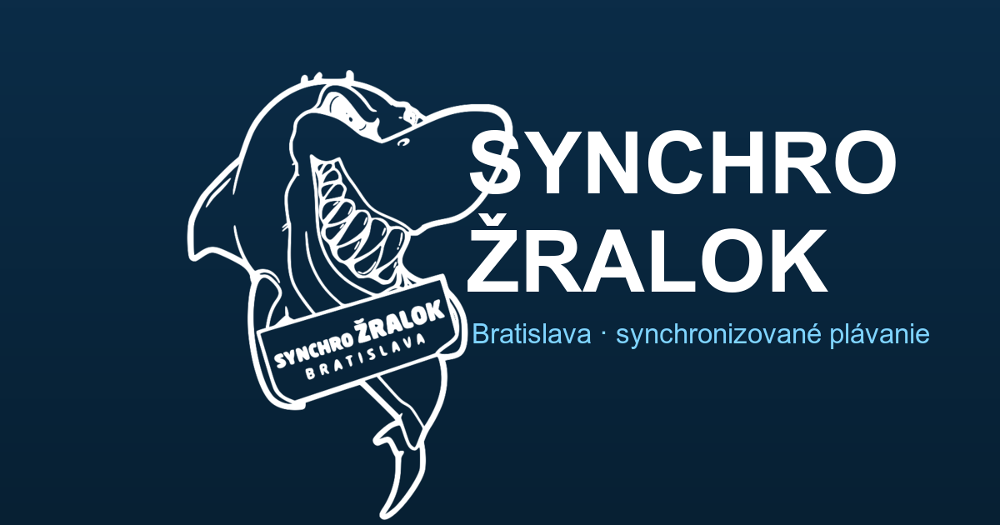

# SYNCHRO Žralok Bratislava

A modern, fully bilingual landing page for **SYNCHRO Žralok Bratislava** — a children's
synchronised (artistic) swimming club. The club previously existed only on Instagram;
this site gives it a polished, fast, search‑ and AI‑discoverable home on the web.

🔗 **Live:** [synchrozralok.sk](https://synchrozralok.sk) · [synchrozralok.com](https://synchrozralok.com)



---

## About

A non‑commercial project built pro bono for a kids' sports club. The goal: turn a single
Instagram account into a credible, welcoming website that helps parents discover the club,
see its achievements, and sign their daughters up — in both Slovak and English.

## Highlights

- **Fully bilingual (SK / EN), one codebase.** Slovak on `.sk`, English on `.com`, built
  from a single source with a shared i18n layer — every string, page, form, email and
  meta tag is localised. Proper `hreflang`, per‑locale canonicals and sitemaps.
- **Built to be found — by search engines and AI.** Rich Schema.org structured data
  (SportsOrganization, FAQPage, Event, Breadcrumbs), per‑locale `robots.txt` + `sitemap`,
  and machine‑readable `llms.txt` / `llms-full.txt` so AI assistants can accurately
  recommend the club for local queries (camps, kids' clubs, synchronised swimming).
- **Live application form.** Modal sign‑up form with anti‑bot protection (reCAPTCHA +
  honeypot), server‑side validation, and transactional emails to both the club and the
  parent — localised to the visitor's language. Secrets never leave the server.
- **Data‑driven content.** The medal tally, competition history and gallery are generated
  from the club's public Instagram, then committed as static JSON — no runtime dependency.
- **Fast & accessible.** Static output, lazy‑loaded media, a deterministic masonry gallery
  that renders identically across browsers, mobile/iOS‑hardened forms, and a recolourable
  vector logo for crisp rendering at any size.
- **Automated delivery.** Push‑to‑deploy via GitHub Actions to a Hetzner + nginx server,
  with HTTPS, www→non‑www redirects and zero‑downtime updates for both language sites.

## Tech stack

**Astro 5** (static output) · **Tailwind CSS v4** · **GitHub Actions** CI/CD ·
**nginx** on Hetzner · **PHP** form endpoint · **Mailgun** (transactional email) ·
**reCAPTCHA v2**.

## Local development

```bash
npm install
npm run dev      # http://localhost:4321
npm run build    # Slovak build  → ./dist
PUBLIC_LOCALE=en npm run build -- --outDir dist-en   # English build → ./dist-en
```

Section data lives in `src/content/` (regenerated from Instagram via `npm run data`).
Deployment notes: see [DEPLOY.md](./DEPLOY.md).

---

## Credits

Designed & developed by **White Eagles & Co.** — [whiteeagles.sk](https://whiteeagles.sk)

Content, photos & brand: SYNCHRO Žralok Bratislava
([@synchro.zralok.bratislava](https://www.instagram.com/synchro.zralok.bratislava/)).
